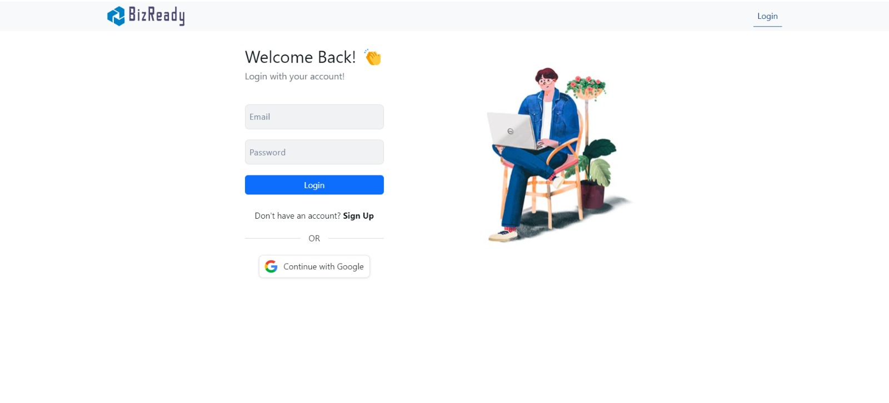
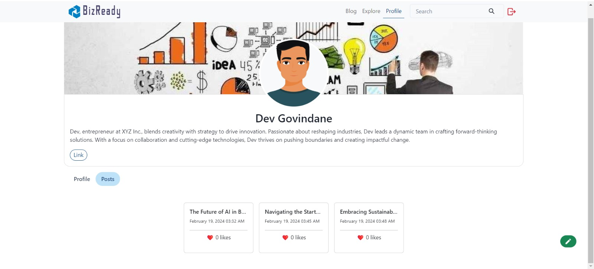

Here’s a comprehensive README file for your project "BizReady":

```markdown
# BizReady
Join our vibrant community of innovators, creators, and startup enthusiasts.
Turn your ideas into reality!

## Description
Our solution addresses the problem of creating and managing user accounts and
profiles in a web application. It allows users to register for an account, providing
necessary information such as name, email, and password. Additionally,
users can create either personal profiles or startup profiles, each with their
own set of attributes.

By providing a structured approach to user management and profile creation, our solution
simplifies the process for developers and ensures a consistent user experience for end-users.
It streamlines the registration process, facilitates the creation of user profiles,
and enables easy management of user data within the application. Ultimately, our solution
enhances the overall usability and functionality of the web application by providing robust
user account and profile management capabilities.

## Technologies Used
- **HTML**
- **CSS**
- **JavaScript**
- **Node.js**
- **Express.js**
- **MongoDB**
- **MERN Stack**
- **Mongoose**
- **React.js**

### Prerequisites
Make sure you have the following installed:
- Node.js
- npm (Node Package Manager)
- MongoDB

### Steps
1. **Clone the repository:**
   ```sh
   git clone https://github.com/Siddc11/BizReady.git
   cd BizReady
   ```

2. **Install server dependencies:**
   ```sh
   cd server
   npm install
   ```

3. **Install client dependencies:**
   ```sh
   cd ../client
   npm install
   ```

4. **Create a `.env` file in the `server` directory and add the following:**
   ```env
   PORT=5000
   MONGO_URI=your-mongodb-uri
   JWT_SECRET=your-jwt-secret
   ```

5. **Run the server:**
   ```sh
   cd ../server
   npm start
   ```

6. **Run the client:**
   ```sh
   cd ../client
   npm start
   ```

7. **Open your browser and navigate to:**
   ```
   http://localhost:3000
   ```

## Features
- **User Registration:** Users can register by providing their name, email, and password.
- **Profile Creation:** Users can create either personal profiles or startup profiles.
- **User Authentication:** Secure user authentication with JWT.
- **Profile Management:** Easy management of user data and profiles.
- **Blog Writing:** User can easily write blogs and post it.

## Contributors
I would like to thank my team members for their invaluable contributions:

- [@MadhukrishnaNipankar](https://github.com/MadhukrishnaNipankar)
- [@GandharvKulkarni](https://github.com/gandharvak)

## Screenshots:
<div>
   <h5>Landing Page & Login Page</h5>
    
    
</div>
<div>
    <h5>Feeds/Blogs Page & Profile Page</h5>
   
   
</div>
<div>
    <h5>WriteBlog Page & UpdateProfile Page</h5>
    
    
</div>

## Demo Video
[](https://www.youtube.com/watch?v=_CVNjdClxiw&t=1s)

